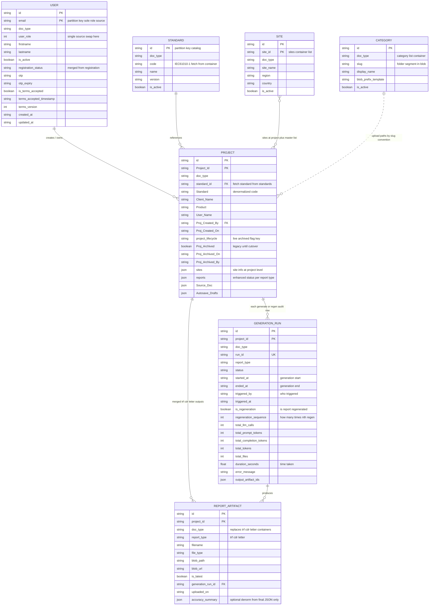
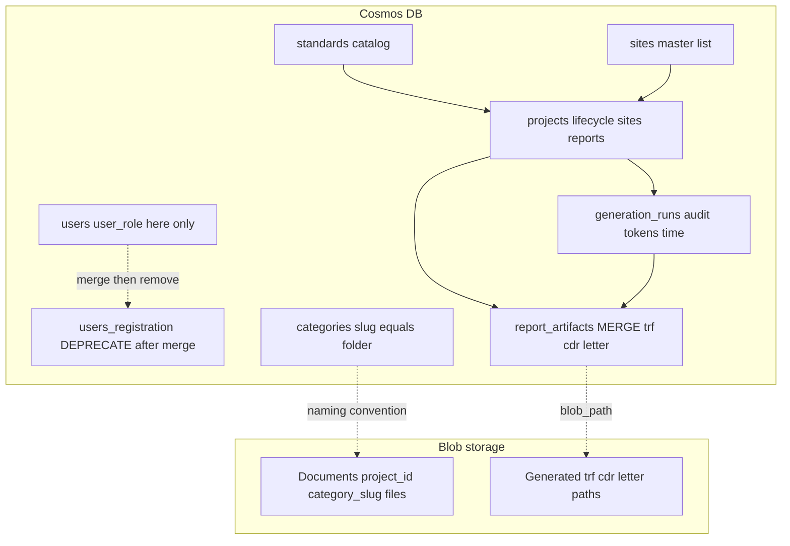
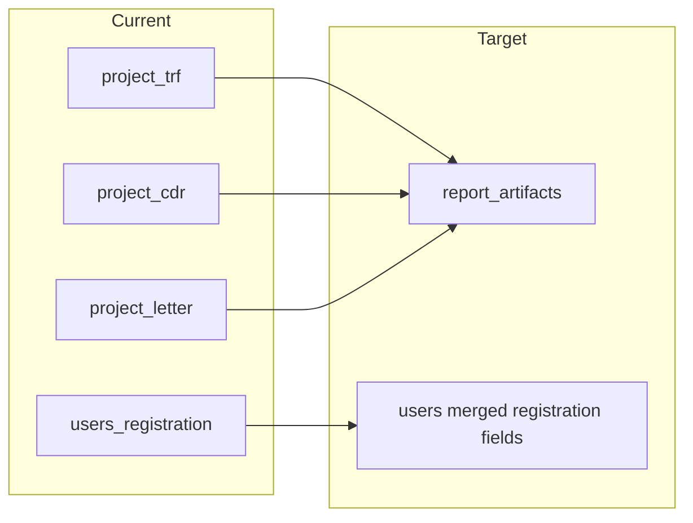

# InterTek AI — Logical data model (ER) for Cosmos DB

**Purpose:** Shareable reference that maps **all agreed DB enhancements** to entities, fields, and containers (Cosmos + Blob).

**How to view / export**

- Open in **VS Code** with a Mermaid preview extension, or
- Paste each ` ```mermaid ` block into [mermaid.live](https://mermaid.live) → export **PNG/SVG** for stakeholders.

**Note:** Cosmos DB is document-oriented; this is a **logical ER** (implementation still uses partition keys and JSON documents).

---

## Requirements checklist → where it lives

| # | Requirement | Container / location | Fields / behaviour |
|---|-------------|----------------------|-------------------|
| 1 | **Generation start time, end time** | `generation_runs` | `started_at`, `ended_at` (ISO-8601 UTC) |
| 2 | **Who triggered** | `generation_runs` | `triggered_by` (email or user id), optional `triggered_at` |
| 3 | **Is report regenerated?** | `generation_runs` + summary on `projects` | Run: `is_regeneration` (bool). Project: `reports.{trf\|cdr\|letter}.is_regenerated` |
| 4 | **How many times it regenerated** | `generation_runs` + summary on `projects` | Run: `regeneration_sequence` (0 = first generation, 1+ = nth regen). Project: `reports.*.regeneration_count` (max or count of regen runs) |
| 5 | **Token consumed on each regeneration** | `generation_runs` | Per run: `total_prompt_tokens`, `total_completion_tokens`, `total_tokens` (each regen = one run document) |
| 6 | **Total LLM calls** | `generation_runs` | `total_llm_calls` (integer, per run) |
| 7 | **total_prompt_tokens** | `generation_runs` | `total_prompt_tokens` |
| 8 | **total_completion_tokens** | `generation_runs` | `total_completion_tokens` |
| 9 | **total_files** | `generation_runs` | `total_files` (input files for that run; same intent as `input_files_count`) |
| 10 | **Time taken** | `generation_runs` | `duration_seconds` (derived: `ended_at` − `started_at`, stored for querying) |
| 11 | **Sites information at project level** | `projects` | `sites[]`: `{ site_id, site_name, ... }` (denormalized for list views) |
| 12 | **Sites list container** | `sites` (new) | Master list: `site_id`, `site_name`, `region`, `country`, `is_active` |
| 13 | **Category list container & category-wise folder in blob** | `categories` (new) + Blob | Cosmos: `slug`, `display_name`, `blob_prefix_template`. Blob: `Documents/{project_id}/{category_slug}/...` driven by `slug` |
| 14 | **Swap user role fields to users container** | `users` | **Single source of truth:** `user_role` only on `users`. Remove/stop duplicating role on registration payloads elsewhere. |
| 15 | **Clean up user registration container** | `users` + deprecate `users_registration` | Merge registration fields into `users` (`registration_status`, OTP/terms fields). Decommission `users_registration` after migration. |
| 16 | **Verify requirement and merge TRF, CDR, Letter containers** | `report_artifacts` (new) | One container; discriminator `report_type` = `trf` \| `cdr` \| `letter`. Same shape as today’s file metadata (`project_id`, `filename`, `file_type`, `blob_path`, `blob_url`, …). |
| 17 | **Archive project implementation** | `projects` | Use `status` + audit fields (see below). Keep `Proj_Archived` during migration if APIs depend on it. |
| 18 | **Flag key: project live or archive** | `projects` | `project_lifecycle` or `status`: `live` \| `archived` (explicit flag for APIs and dashboards) |
| 19 | **Standard list container; fetch standard from container** | `standards` (new) | `projects.standard_id` → `standards.id`. UI/API loads catalog from `standards`; project stores id + denormalized `Standard` (code) for offline list rendering. |
| 20 | **Project status capture enhancements** | `projects` | Nested `reports.trf` / `reports.cdr` / `reports.letter`: `status`, `stage`, `step`, `percentage`, `completed`, `error`, `last_updated`, plus generation summary fields (last run id, last regen, counts). |
| 21 | **Accuracy — part of final JSON only** | **Blob (final JSON)** is source of truth | Full accuracy tree stays **only** in the generated JSON in blob. Optional **denormalized** `accuracy_summary` on `report_artifacts` (or last `generation_runs` outcome) for dashboards — must be documented as a copy, synced when final JSON is written. |

---

## Logical ER diagram (includes generation, sites, categories, accuracy touchpoint)



---

## `GENERATION_RUN` — field reference (copy-paste for implementers)

| Field | Type | Meaning |
|-------|------|--------|
| `started_at` | string (ISO) | Generation **start** time |
| `ended_at` | string (ISO) | Generation **end** time |
| `triggered_by` | string | **Who** triggered (email / id) |
| `triggered_at` | string | When the job was queued / button clicked |
| `is_regeneration` | bool | **Is** this run a regeneration? |
| `regeneration_sequence` | int | **How many times** in sequence (0 = first gen, 1 = first regen, …) |
| `total_prompt_tokens` | int | Tokens (prompt) **for this run** |
| `total_completion_tokens` | int | Tokens (completion) **for this run** |
| `total_tokens` | int | Optional rollup for this run |
| `total_llm_calls` | int | **Total LLM calls** for this run |
| `total_files` | int | **Total files** in scope for this run (inputs) |
| `duration_seconds` | float | **Time taken** (`ended_at` − `started_at`) |

Rollups across all runs for a project/report type = aggregate queries on `generation_runs` (or materialized counters on `projects.reports.*`).

---

## `PROJECT` — lifecycle, sites, status (enhancements)

| Area | Suggested fields |
|------|------------------|
| **Live / archive flag** | `project_lifecycle`: `live` \| `archived` (explicit key for APIs) |
| **Archive audit** | `Proj_Archived_On`, `Proj_Archived_By` (align with existing naming) |
| **Sites at project level** | `sites`: `[{ "site_id", "site_name", "region?" }]` — references **SITE** master |
| **Status enhancements** | `reports.trf` / `reports.cdr` / `reports.letter`: `status`, `stage`, `step`, `percentage`, `completed`, `error`, `last_updated`, `last_generation_run_id`, `regeneration_count`, `is_regenerated` |

---

## Accuracy (final JSON only)

| Layer | Rule |
|-------|------|
| **Authoritative** | Accuracy lives **inside the final report JSON** in **Blob** (as today). |
| **Cosmos** | Do **not** duplicate the full accuracy tree unless needed for search. Optional `accuracy_summary` on `report_artifacts` (small object: e.g. overall score, counts) updated when final JSON is persisted — document as **derived**, not source of truth. |

---

## Cosmos containers + Blob (includes categories path)



---

## Merge verification: TRF / CDR / Letter → `report_artifacts`

| Legacy container | Target | Verification |
|------------------|--------|----------------|
| `project_trf` | `report_artifacts` where `report_type = trf` | Row count + spot-check `blob_path` / `blob_url` |
| `project_cdr` | `report_type = cdr` | Same |
| `project_letter` | `report_type = letter` | Same |
| Queries using `project_id` + `file_type` | Unchanged filter shape | Add `report_type` to all new writes |

---

## Legacy → target migration (overview)



---

## Relationship cheat sheet

| From | To | Cardinality | How stored |
|------|-----|-------------|------------|
| USER | PROJECT | 1 : N | `Proj_Created_By` = user email; **role only on USER** |
| STANDARD | PROJECT | 1 : N | `standard_id` + denormalized `Standard` |
| SITE | PROJECT | N : M | `projects.sites[]` + master **SITE** container |
| CATEGORY | Blob paths | 1 : N paths | `slug` → `Documents/{project_id}/{slug}/` |
| PROJECT | REPORT_ARTIFACT | 1 : N | `project_id` partition |
| PROJECT | GENERATION_RUN | 1 : N | `project_id` partition |
| GENERATION_RUN | REPORT_ARTIFACT | 1 : N | `generation_run_id` on artifact |

---

*Last updated: full stakeholder requirement list reflected in ER and tables.*
